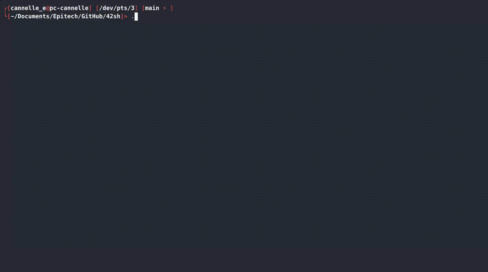

# 42sh

> Full Unix shell based on TCSH - EPITECH B-PSU-200 Project

---

## Table of contents
1. [Demo](#demo)
2. [Overview](#overview)
3. [Project progression](#project-progression)
4. [Compilation](#compilation)
5. [Usage](#usage)
6. [Features](#features)
    a) [Builtins](#builtins)
    b) [Redirections & pipes](#redirections--pipes)
    c) [Job control](#job-control)
    d) [Variables](#variables)
    e) [History](#history)
    f) [Aliases](#aliases)
    g) [Globbing](#globbing)
    h) [Line edition](#line-edition)
7. [Project architecture](#project-architecture)

---

## Demo



---

## Overview

**42sh** is a fully-featured Unix shell written in C, modeled after TCSH. It is the culmination of a three-project series:

- [B-PSU-200_minishell1.pdf](B-PSU-200_minishell1.pdf) — basic command execution, PATH, and builtins (`cd`, `setenv`, `unsetenv`, `env`, `exit`)
- [B-PSU-200_minishell2.pdf](B-PSU-200_minishell2.pdf) — semicolons, pipes, and the four redirections (`>`, `<`, `>>`, `<<`)
- [B-PSU-200_42sh.pdf](B-PSU-200_42sh.pdf) — the full shell: job control, variables, history, aliases, globbing, line edition, scripting, and more

The reference shell for syntax and compatibility is **tcsh**. Stability is prioritized over quantity of features.

---

## Project progression

| Project | Features added |
| --- | --- |
| **Minishell1** | Command execution via `PATH`, builtins (`cd`, `setenv`, `unsetenv`, `env`, `exit`), proper exit codes |
| **Minishell2** | Semicolons (`;`), pipes (`\|`), redirections (`>`, `<`, `>>`, `<<`) |
| **42sh** | Inhibitors (`''`, `""`), globbing (`*`, `?`, `[…]`), job control (`&`, `fg`, `bg`), backticks (`` ` ``), parentheses, local & env variables, special variables, history (`!`), aliases, dynamic line editing, auto-completion, scripting |

---

## Compilation

```sh
# Compile the project
make

# Clean object files
make clean

# Remove everything (objects + binary)
make fclean

# Recompile from scratch
make re
```

---

## Usage

```sh
./42sh
```

The shell starts in interactive mode and displays a prompt. Commands are executed after pressing Enter.

```sh
# You can also pipe commands directly to the shell
echo "ls -l" | ./42sh
```

Error messages are written to stderr. The shell exits with the same error code as TCSH would in the same situation.

---

## Features

### Builtins

| Command | Description |
| --- | --- |
| `cd [dir]` | Change current directory. Updates `cwd` and triggers `cwdcmd` if set |
| `setenv VAR val` | Set an environment variable |
| `unsetenv VAR` | Unset an environment variable |
| `env` | Display all environment variables |
| `exit [code]` | Exit the shell with optional exit code |
| `history` | Display the command history |
| `alias [name [cmd]]` | Display or define an alias |
| `fg [%job]` | Bring a background job to the foreground |
| `which cmd` | Show the full path of a command |

### Redirections & pipes

| Syntax | Description |
| --- | --- |
| `cmd > file` | Redirect stdout to file (overwrite) |
| `cmd >> file` | Redirect stdout to file (append) |
| `cmd < file` | Redirect stdin from file |
| `cmd << delim` | Here-document: read stdin until `delim` |
| `cmd1 \| cmd2` | Pipe stdout of `cmd1` to stdin of `cmd2` |
| `cmd1 ; cmd2` | Execute `cmd1` then `cmd2` sequentially |
| `cmd1 && cmd2` | Execute `cmd2` only if `cmd1` succeeds |
| `cmd1 \|\| cmd2` | Execute `cmd2` only if `cmd1` fails |

### Job control

| Syntax | Description |
| --- | --- |
| `cmd &` | Run `cmd` in the background |
| `fg [%job]` | Bring a background job to the foreground |
| `bg [%job]` | Resume a stopped job in the background |

### Variables

```sh
# Local variable
set myvar = "hello"
echo $myvar

# Environment variable
setenv PATH /usr/bin:/bin
echo $PATH
```

**Special variables:**

| Variable | Description |
| --- | --- |
| `$cwd` | Current working directory |
| `$term` | Terminal type |
| `$precmd` | Command executed before each prompt display |
| `$cwdcmd` | Command executed whenever the directory changes |
| `$ignoreof` | If set, `CTRL+D` does not exit the shell |

### History

```sh
# Display history
history

# Re-execute last command
!!

# Re-execute command number N
!N

# Re-execute last command starting with "str"
!str
```

### Aliases

```sh
# Define an alias
alias ll "ls -l --color"

# Use it
ll /tmp

# Remove an alias
unalias ll

# List all aliases
alias
```

### Globbing

| Pattern | Description |
| --- | --- |
| `*` | Matches any sequence of characters |
| `?` | Matches any single character |
| `[abc]` | Matches any character in the set |

```sh
ls *.c
ls src/???.c
ls include/[am]*.h
```

### Line edition

| Key | Action |
| --- | --- |
| `←` / `→` | Move cursor left / right |
| `↑` / `↓` | Navigate command history |
| `Tab` | Auto-complete command or filename |
| `Ctrl+A` | Move to beginning of line |
| `Ctrl+E` | Move to end of line |
| `Ctrl+C` | Cancel current line |
| `Ctrl+D` | Exit shell (unless `$ignoreof` is set) |
| `bindkey` | Display or remap key bindings |

Multiline editing is supported: if the line is syntactically incomplete (e.g. unclosed quote or pipe at end of line), a continuation prompt is displayed.

---

## Project architecture

```
.
├── include/
│   ├── ast.h           # AST node types and parser interface
│   ├── commands.h      # Builtin command prototypes
│   ├── errors.h        # Error codes and messages
│   ├── list.h          # Linked list interface
│   ├── mysh.h          # Main shell state structure
│   ├── pipe.h          # Tokenizer and pipe types
│   ├── structs.h       # Shared structures
│   └── utilities.h     # Utility function prototypes
├── src/
│   ├── ast/
│   │   ├── command_parser.c    # Parses individual commands
│   │   ├── create_ast.c        # Builds the AST from tokens
│   │   ├── execute_ast.c       # Walks and executes the AST
│   │   ├── execute_builtins.c  # Dispatches to builtin handlers
│   │   ├── execute_pipe.c      # Pipeline execution
│   │   ├── parser_ast.c        # Top-level AST parser
│   │   ├── pipeline_parser.c   # Pipeline node parsing
│   │   ├── redirections.c      # Redirection setup
│   │   └── validate_syntax.c   # Syntax validation pass
│   ├── commands/
│   │   ├── env.c               # env builtin
│   │   ├── executor.c          # External command execution
│   │   ├── my_alias.c          # alias / unalias builtins
│   │   ├── my_cd.c             # cd builtin
│   │   ├── my_exit.c           # exit builtin
│   │   ├── my_fg.c             # fg builtin
│   │   ├── my_getenv.c         # Variable lookup helpers
│   │   ├── my_history.c        # history builtin
│   │   ├── my_history_bang.c   # History expansion (!)
│   │   ├── my_setenv.c         # setenv builtin
│   │   ├── my_unsetenv.c       # unsetenv builtin
│   │   └── my_which.c          # which builtin
│   ├── pipe/
│   │   ├── redirection.c           # Redirection file handling
│   │   ├── tokenize.c              # Input tokenizer
│   │   └── tokenize_with_quotes.c  # Quote-aware tokenizer
│   ├── linked_list/
│   │   ├── list.c              # Linked list core
│   │   └── list_array.c        # List-to-array conversion
│   ├── utilities/
│   │   ├── char_utilities.c    # Character helpers
│   │   ├── concat_args.c       # Argument concatenation
│   │   ├── count_args.c        # Argument counting
│   │   ├── error_handling.c    # Error display
│   │   ├── file_path.c         # Path resolution helpers
│   │   ├── frees.c             # Memory cleanup
│   │   ├── free_utilities.c    # Additional free helpers
│   │   ├── is.c                # Character/string predicates
│   │   ├── prepend.c           # String prepend utility
│   │   ├── print_help.c        # Help display
│   │   ├── strisdigit.c        # Digit string check
│   │   └── wildcards.c         # Glob pattern expansion
│   ├── bindkey_cmd.c       # bindkey command handler
│   ├── bindkey_mapping.c   # Key binding map
│   ├── command_struct.c    # Command structure helpers
│   ├── config_files.c      # Shell config file loading
│   ├── job_control.c       # Background/foreground job management
│   ├── multiline.c         # Multiline input handling
│   ├── need_multiline.c    # Multiline continuation detection
│   ├── parenthesis.c       # Parenthesized expression handling
│   ├── path_handler.c      # PATH resolution
│   ├── prompt.c            # Prompt display
│   ├── setup.c             # Shell initialization
│   └── truth_table.c       # && and || operator handling
├── main.c
├── Makefile
├── B-PSU-200_minishell1.pdf
├── B-PSU-200_minishell2.pdf
└── B-PSU-200_42sh.pdf
```
